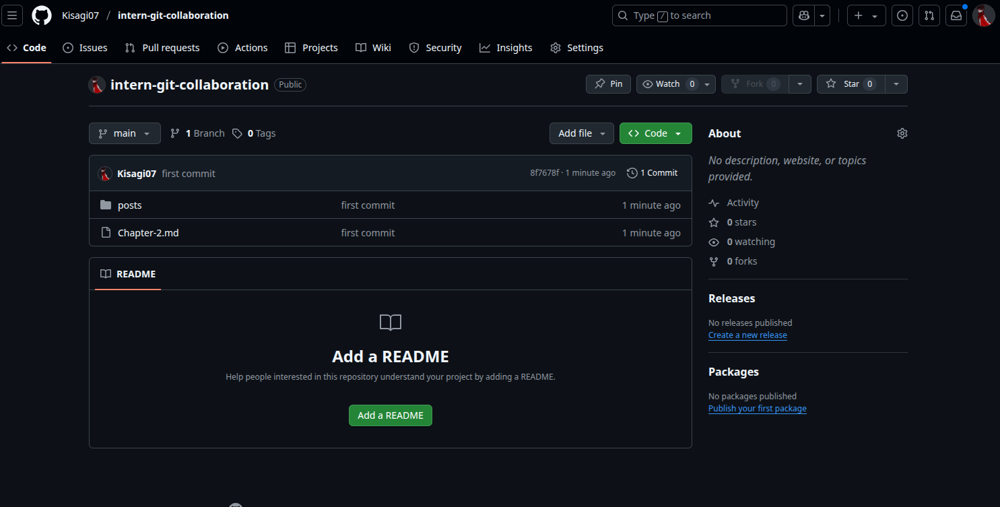

# Git Collaboration



## Langkah-langkah Melakukan Git Collaboration

Berikut ini adalah langkah-langkah untuk melakukan kolaborasi menggunakan Git dan GitHub:

### 1. Clone Repository
Clone repository dari GitHub ke komputer lokal:

```bash
git clone https://github.com/NAMA-USER/NAMA-REPO.git
cd NAMA-REPO
```

### 2. Buat Branch Baru
Gunakan format penamaan: `feat/blog-andri`  
Contoh jika membuat blog:

```bash
git checkout -b feat/blog-andri
```

### 3. Tambahkan Konten atau Fitur Baru
Tambahkan file baru sesuai tugas (misalnya blog), dengan format:

- **Judul**
- **Gambar**
- **Isi konten**
- Nama file: `blog-[namapanggilan].md`

Contoh:

```markdown
# Tips Belajar Git


Git membantu kita dalam mengelola versi kode dalam tim. Pastikan kamu memahami konsep commit, branch, dan pull request.
```

### 4. Commit Perubahan
Setelah membuat perubahan:

```bash
git add .
git commit -m "feat: tambah blog andri"
```

### 5. Push ke GitHub

```bash
git push origin main
```

### 6. Buat Pull Request
- Buka halaman GitHub repository
- Klik **"Compare & pull request"**
- Isi deskripsi PR dan klik **"Create pull request"**
